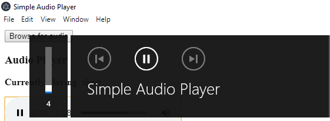

# Electron-fagkveld

Electron tutorial til frontend fagkveld 28.02.2019

## Resources & Tips

Links and tips that might be useful

- If using VS Code you can right click on this file as choose "Open Preview"
- [Official Electron documentation](https://electronjs.org/docs)
- Refresh and reload content in BrowserWindows with CTRL + SHIFT + R.
- Use DevTools to debug BrowserWindows. Open Devtools with CTRL + SHIFT + J
- Use your IDE to debug the main process. [Link to debug main process in VS Code](https://electronjs.org/docs/tutorial/debugging-main-process-vscode).
- Check out the possibilities with the [Electron API Demo App](https://github.com/electron/electron-api-demos)
  - Either clone repo or download and install as program

## Tutorial: Simple Audio Player app

In this tutorial we will create an audio player. The files we are going to write code in are: ```index.js```, ```audioplayer.html``` and ```audioplayer.js```. You can use ```npm start``` or ```electron .``` to run the program.

### The basic audio player

#### Audio element

1. There is already an [audio element](https://www.w3schools.com/html/html5_audio.asp) in audioplayer.html that uses HTML5 to play audio. We need to get the path for an audio file the user selects to use it as source. Getting a file path is a perfect job for the [showOpenDialog method](https://electronjs.org/docs/api/dialog#dialogshowopendialogbrowserwindow-options) from dialog API. Since dialog API only works in the main process and we want the user to pick the audio file when interacting with audioplayer.html we must use [ipcRenderer invoke](https://electronjs.org/docs/api/ipc-renderer#ipcrendererinvokechannel-args) method in the renderer process to call an [ipcMain.handle method](https://electronjs.org/docs/api/ipc-main#ipcmainhandlechannel-listener) in the main process.
   - Add a button "Browse for audio" in audioplayer.html, that when clicked calls getAudioFilePath in the main process.
   - The getAudioFilePath should invoke a showOpenDialog method. In showOpenDialog options, you can use the following as filters:

        ```JavaScript
        filters: [{
            name: "Audio",
            extensions: ["mp3", "ogg", "wav"]
        }]
        ```

   - In getAudioFilePath return the path to the selected file (or a Promise that resolves the filePath).
   - Finish the implementation and you should be able to select and play audio files!
2. If the user clicks the "Browse for audio" button again one need to delete/replace the current source to be able to play the new source.
   - Delete the previous source element / replace the src attribute when the user selects a new one.
   - Call the ```load()``` method on your audio element to force it to reload the source.

#### Track information

Showing the title of the song is a must-have feature. We can simply use the filename.

1. When a song has been selected, update the paragraph ```#trackInformation``` with the text "Currently playing" followed by the name of the song.
   - Tips: There are useful functions in the [Node path package](https://nodejs.org/docs/latest-v10.x/api/path.html) to support paths on different OS.
2. Update the title of the electron window with the song name. The title is by default used in the volume pop-up in Windows. (I don't know what happens for Mac and Linux)

3. Set the title of the electron window back to the APP_TITLE declared in main.js when the song ends. This time, instead of using the IPC methods directly, you can use the [remote module](https://electronjs.org/docs/api/remote) and [getGlobal method](https://electronjs.org/docs/faq#how-to-share-data-between-web-pages) if you want.
   - Tips:  The audio element emits an "ended" event
   - Note: The remote module might get [deprecated in the future](https://github.com/electron/electron/issues/21408).

### Additional features

#### Notifications

We want to spam the user with a notification each time a song begins to play. We can use the HTML5 Notification API.

1. (Mac and Linux) Use the [Notification tutorial](https://electronjs.org/docs/tutorial/notifications) and show the title of the current song playing.
2. (Windows) The above code works on Windows too, just not in development (without an Application User Model ID). To see that notifications works we can use the [Tray API](https://electronjs.org/docs/api/tray) and display a [balloon in the tray](https://electronjs.org/docs/api/tray#traydisplayballoonoptions-windows) (which on Windows 10 seems to have the exact same appearance as a notification).
   - Create a new Tray
   - Show the title of the song in the balloon. Use ```favicon-32x32.png``` in assets as icon.
   - NB: When displaying the balloon please set the icon field to avoid [a bug](https://github.com/electron/electron/issues/5844)

#### Open in another program

We want the ability to open the song in another music app.

1. Create a button.
2. Use Node.js [Child Process API](https://nodejs.org/api/child_process.html#child_process_child_process_exec_command_options_callback) to access the command line. Import exec and execute the below commands.

    ```JavaScript
    const { exec } = require('child_process')
    ```

   - Windows: ```start wmplayer "PATH_TO_SONG.mp3"``` (Windows Media Player cannot play OGG files, so try with mp3.
   - Mac: ```open "PATH_TO_SONG.mp3"```
   - Linux: Google it

#### Possibly some more

And now we want to… creep the user out by using the [Clipboard API](https://electronjs.org/docs/api/clipboard)?

Or perhaps play with the [Menu API](https://electronjs.org/docs/api/menu). The sky is the limit! Bring your desktop app to world dominance!
